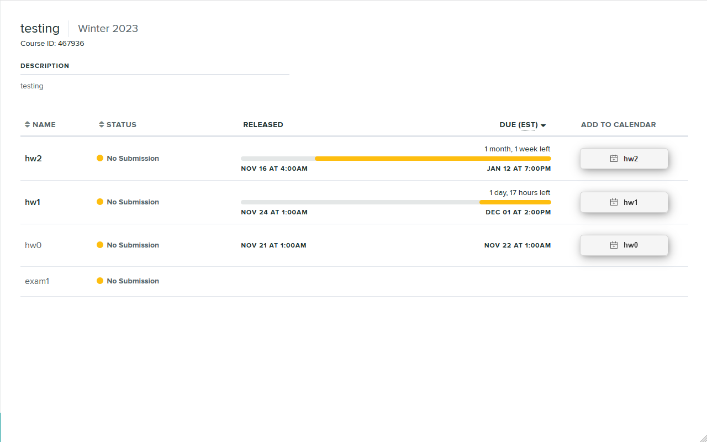
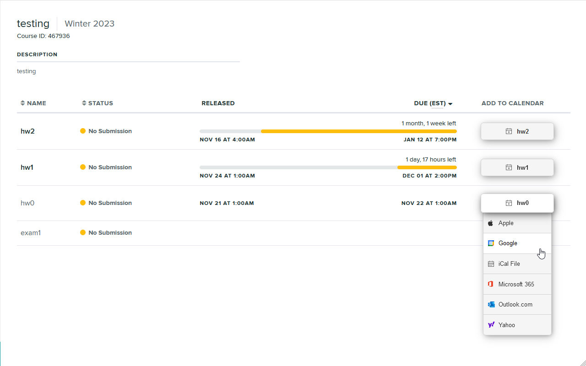

# Gradescope Add to Calendar Button

    
    

Adds a button to create calendar events next to all Gradescope assignments.

Uses [Add to Calendar Button](https://github.com/add2cal/add-to-calendar-button) to generate links.

## Third Party Libraries

### Add To Calendar Button

* [atcb.min.js](https://github.com/add2cal/add-to-calendar-button/blob/main/dist/atcb.min.js)
* [atcb.min.css](https://github.com/add2cal/add-to-calendar-button/blob/main/assets/css/atcb.min.css)
